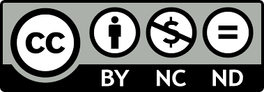

## License

The framework of the hosted webpage was forked from the theme [Hydeout](https://github.com/fongandrew/hydeout), which is regulated by the [MIT License](https://opensource.org/licenses/MIT). 

The contents of the webpage is regulated by the [Creative Commons Attribution-NonCommercial-NoDerivatives 4.0 International Public License](https://creativecommons.org/licenses/by-nc-nd/4.0/).

Please contact me at [mingchu.xu@alumni.bcm.edu](mingchu.xu@alumni.bcm.edu) for furthur questions.
